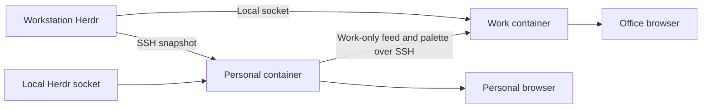

# Herdr Observatory

A passive display of Herdr agent activity across your machines. See working agents, tasks needing input, project titles, sampled state changes and resource telemetry in a full-screen dashboard that follows your Omarchy palette.

No agent controls, terminal transcripts or cloud service. Optional Work feeds and a persistent office-display service are explicitly deployed. Python 3.11+ standard library on collector hosts, a browser, Herdr 0.9.x with `api snapshot`, and OpenSSH for remote collection. The browser uses a locally bundled React 19 view; npm is needed only when rebuilding that asset.

## What needs to be installed

Observatory's server, collectors, telemetry reporter, music observer and feed receivers are packaged in the same Docker image. Deploying the dashboard does not install a music service or a second host agent. The browser renders the display separately from Docker.

| Requirement | In the Observatory image | What the host supplies |
| --- | --- | --- |
| Application runtime | Python, application modules, OpenSSH client, static browser assets | Docker Engine with Docker Compose; permission to run the container |
| Agent activity | Read-only Herdr socket/SSH collector | Existing Herdr installation and running session; its socket directory mounted into the container |
| Remote machines | Probe sent over SSH without remote installation | Existing SSH/Tailscale connectivity, Python 3.11+ and Herdr on each collector host |
| OS theme | Palette reader and validated palette transport | Existing Omarchy palette files mounted read-only; no Omarchy API, hook or theme modification |
| Display | Bundled JavaScript, WASM and Nerd Font served locally | A browser; Canvas and WASM rendering consume browser resources outside the container |
| Optional music | cliamp observer, persistent SSH publisher and receiver module | An already-running native cliamp v2 user player with its Unix socket; optional read-only socket-directory mount |
| Optional Codex/Pi telemetry | Reporter and adapter installer/payloads | Tiny event-triggered shell/Pi adapters, harness configuration and Docker CLI access from the harness environment |
| Private deployment settings | No embedded secrets or machine-specific configuration | Private config, SSH credentials where required, verified known-host records and Compose environment files outside the image |

The optional harness adapters are the small host-side additions described below. Music needs no Observatory daemon installer, database, browser audio playback or audio capture. Existing cliamp remains the user's player, and Docker remains the application's service manager.

## Architecture and daily operation

Both Personal and Work installations run the same dedicated, versioned Observatory image under Docker Compose. The Personal instance collects the fleet and sends a Work-only projection plus the active palette to the office instance over Tailscale SSH. The office instance also collects its own local agents independently. Neither depends on a development checkout or an interactive SSH session.



The browser on each host opens **http://localhost:8789**. On a native Linux installation, the recommended Compose directory is `~/.local/share/herdr-observatory/deploy`; for the named-volume Work installation below it is `~/.local/state/herdr-observatory/deployment`. Run these commands inside the installed directory:

```sh
docker compose ps                  # container and health status
docker compose logs --tail=50      # recent application logs
docker compose restart            # restart the installed release
docker compose stop               # stop now and keep stopped across reboots
docker compose start              # resume it and restore normal autostart
lazydocker                        # interactive Docker management, if installed
```

Both services use `unless-stopped`, health checks, bounded logs and read-only root filesystems. Enable the Linux Docker service at boot; the Windows workstation also needs its existing WSL headless startup. The containers do not open the browser automatically or override screen-lock policy. Installation, update and rollback instructions are below.

## Controlling autostart

The application runs in Docker on both machines. There is no separate Observatory systemd service, cron job or development server. On iapetus, the enabled system Docker service starts the container at boot. On the workstation, the existing Windows headless startup starts WSL, then its native Docker engine starts the container. Compose does not start Windows or WSL.

Docker's `unless-stopped` policy controls the application. To stop Observatory and leave it stopped across reboots, use `docker compose stop` in its deployment directory. To resume it, use `docker compose start`. This affects Observatory only; do not disable the shared Docker engine to stop this application.

For the installed container, these equivalent commands work from any directory:

```sh
docker stop herdr-observatory       # stop and keep stopped across reboots
docker start herdr-observatory      # resume, including subsequent boot startup
docker logs --tail=50 herdr-observatory
```

Run workstation commands through `ssh omaterm@ws-255`, for example `ssh omaterm@ws-255 docker stop herdr-observatory`.

To keep the application running now but disable automatic restarts, change `restart: unless-stopped` to `restart: "no"` in the installed `compose.yaml`, then run `docker compose up -d --wait`. Restore `unless-stopped` and apply again to re-enable automatic restarts. Keep that local policy when replacing deployment files during upgrades. A one-off `docker update --restart=no` is not a durable Compose setting: recreation restores the policy from the Compose file.

The browser is separate and does **not** autostart. Open `http://localhost:8789` manually. `deploy/Start-OfficeDisplay.ps1` is a manual Windows Edge kiosk launcher; this project has not installed a Windows login/startup task for it. Closing the browser does not stop collection. Existing lock and display-sleep policies are unchanged.

## Development run

```sh
cp config.example.json config.local.json
python -m observatory --config config.local.json --profile personal
```

Open **http://127.0.0.1:8789**. Use F or F11 for fullscreen. The card display fills one 16:9 browser viewport at 720p or 1080p, with a compact Rich title and fleet strip above eight prominent thread cards. Recent observations sit in a full-width footer outside the music visualiser. Pane pages rotate every 15 seconds; Page Up/Down selects a page and holds it, R resumes rotation. C cycles All/Work/Personal on the Personal display. Auto-paging is enabled by default when more than eight permitted threads exist. The display has no pause or effect-timer controls; the OS reduced-motion preference suppresses animation. Ctrl+C stops a foreground server.

For a work display:

```sh
python -m observatory --config config.local.json --profile work
```

Work is the default. Add approved absolute paths to each host's `work_roots` before expecting agents there. Personal displays include both categories and provide a project filter. Switching the server profile requires a restart; browser query parameters cannot unlock Personal data.

## Configure machines

Compose uses its private `config/config.json`; the development runner uses `config.local.json`, which is ignored by Git. Keep real usernames, addresses and project roots there, not in examples or issues. Paths are evaluated on the source machine. The narrowest practical allowlist is best; `personal_roots` override work roots, and unclassified paths are always Personal.

```json
{
  "interval": 5,
  "theme_host": "desktop",
  "hosts": [
    {
      "id": "desktop",
      "label": "Desktop",
      "transport": "local",
      "work_roots": ["/home/user/work"],
      "personal_roots": ["/home/user/work/private"]
    },
    {
      "id": "workstation",
      "label": "Workstation",
      "transport": "ssh",
      "target": "workstation-ssh-alias",
      "herdr": "~/.local/bin/herdr",
      "work_roots": ["/home/user/work"]
    }
  ]
}
```

Use your SSH config for users, Tailscale routing, ProxyCommand and keys. Verify `ssh workstation-ssh-alias python3 --version` first. The collector uses batch mode and will not prompt for passwords or approve new host keys. Each sample sends the read-only Python probe over stdin and installs nothing remotely. New machines need working SSH, Python 3.11+ and Herdr before adding them. There is no network discovery.

`herdr` defaults to PATH, then `~/.local/bin/herdr`. Optional `session` chooses a named Herdr session; configure separate host IDs for multiple sessions. Each host has an independent worker. Snapshot polling is compatible with tested Herdr 0.9.0 and 0.9.1, avoiding terminal attach or takeover.

`theme_host` selects the machine supplying the palette. The collector reads `~/.local/state/omarchy/current/theme/colors.toml` and `theme.name`, falling back to the older `~/.config/omarchy/current` location. Valid colour changes appear on the next refresh. Missing colours use Tokyo Night defaults. No Omarchy hooks or config edits are needed. The image bundles JetBrainsMono Nerd Font, served locally to the browser with a monospace fallback; no external font download or host font installation is required.

## Work display and Tailscale

Run an independent Work service on the workstation. The Personal laptop service can publish a Work-only projection over your existing SSH connection on Tailscale; reverse SSH to the laptop is unnecessary. Personal agents and history are removed before data crosses the connection. HTTP stays on loopback, with no public deployment or firewall changes.

Add this optional block to the laptop's private config. Use absolute paths on the receiving machine; these are examples, not deployment defaults:

```json
"publish": {
  "host_id": "desktop",
  "target": "workstation-ssh-alias",
  "container": "herdr-observatory",
  "path": "/feeds/desktop.json"
}
```

The source `host_id` must exist in the laptop config. Work roots there control what leaves the laptop. Personal exclusions win. The receiver runs the installed image in `container`. The publisher invokes its `python3 -m observatory.feed` module through `docker exec -i` over authenticated SSH and atomically writes a 0600 allowlisted file. Feed size is limited to 1 MiB. No HTTP upload endpoint is opened.

On the workstation, configure its local Herdr source plus the laptop feed:

```json
{
  "interval": 5,
  "theme_host": "desktop",
  "hosts": [
    {"id": "workstation", "transport": "local", "work_roots": ["/home/user/work"], "personal_roots": ["/home/user/personal"]},
    {"id": "desktop", "transport": "file", "path": "/feeds/desktop.json"}
  ]
}
```

Start the workstation with `--profile work`. A feed older than 30 seconds stops contributing agents or metrics. Local workstation collection continues independently. The last validated palette remains available from the feed file across display-service restarts. The laptop footer reports whether office synchronisation is working. Theme files on either machine are never modified.

For another browser on the tailnet, use an SSH loopback tunnel:

```sh
ssh -N -L 8789:127.0.0.1:8789 workstation-ssh-alias
```

Open `http://localhost:8789` on a device where port 8789 is free. Host validation requires the forwarded and service ports to match. The laptop's own Personal dashboard already provides its full fleet view without this tunnel. Do not bind the Personal service to a LAN or tailnet address.

### Windows office monitor

The service URL is **http://localhost:8789** on Windows when WSL localhost forwarding reaches the host-networked service. Copy `deploy/Start-OfficeDisplay.ps1` to Windows and run it in your logged-in desktop session. It checks that the endpoint is Work-only before opening Edge in full-screen kiosk mode. Alt+F4 exits the window.

The PowerShell launcher opens the display; the independently running container supplies the data. This avoids starting a second interactive Herdr client. Windows lock/display sleep policies remain unchanged. The container SSH shell cannot launch or verify a Windows desktop window unless Windows interoperability or a GUI connection is separately available.

## Technical display and what the numbers mean

The display takes visual inspiration from [Omarchy](https://omarchy.org): crisp mono typography, pixel accents, thin borders and the current OS palette. Eight thread cards occupy most of the screen, with automatic and manual paging for additional threads. Each prioritises project, meaningful worktree/checkout label, normal Herdr state and model. Hover or keyboard-focus reveals native pane identifier, harness and host. Supported hook data adds phase, tool, model and context/usage details. Missing fields are represented by one coverage note, with no empty metric tiles.

Each card affected by a fresh state or hook change receives a brief impulse; working state indicators remain local to their card. Repeated unchanged samples do not restart the impulse. Hidden, reduced-motion and unavailable views suppress animation.

The fleet panels label processor, memory, graphics, storage and network traffic, with measured glyph histories and sample age in the host tooltip. The active OS theme colours backgrounds, card surfaces, borders, typography and status accents. Existing theme transport is unchanged: the host OS supplies the palette, and the Personal instance forwards it with the permitted Work feed. The browser does not modify the OS theme or need another service.

An opaque full-width footer shows four single-line observations with semantic icons and theme-derived colours: time, project, Herdr state, native pane identifier and pertinent update. Occasional text effects run only on an eligible incoming line here, never on thread cards. Effects finish naturally, then apply a fixed internal 120-second cooldown. Events received during playback or cooldown display immediately, without a backlog of animations. Quiet periods do not replay previous output. Source loss or the line leaving the visible recent history cancels obsolete playback. No decorative project-name artwork or travelling horizontal bands remain.

The bundled JetBrainsMono Nerd Font supplies the same typography on Linux and Windows without external requests. Readable words remain if it fails to load. Font source, checksum and licences live in `web/fonts/`.

Records are timestamped when the browser observes a transition, not when the underlying action happened. Collection is sampled and can miss brief intermediate states; this is not a complete Herdr event stream. Raw terminal content is never exported. Connection loss clears live panes without claiming they finished. The accessible text equivalent contains the current panes and the last 60 observations.

| Card field | Meaning | When absent |
| --- | --- | --- |
| State | Herdr's authoritative lifecycle state | Unknown |
| Activity / Tool | Latest supported hook phase and tool name | Falls back to Herdr state; missing tool omitted |
| Model | Explicit, sanitised hook-reported model name | Omitted, never inferred |
| Context | Approximate hook-reported tokens and window, with a capacity gauge | Omitted with coverage note |
| Session tokens | Cumulative input and output, shown as compact counts | Available side shown; missing side marked unknown |
| Cache read | Cache-read share of total input, with read and uncached token counts; cache writes have a third labelled part when reported | Available counts shown; incomplete balance has no percentage or gauge |
| Last response | Input/output tokens for the reported response | Omitted with coverage note |
| Cache read / write | Reported response cache tokens | Omitted with coverage note |
| Compactions | Count from complete bounded session history | Shown as unknown when history is incomplete |
| Sample age | Age of the fleet source sample | Unavailable and agents excluded when stale |

Custom Herdr token/label maps, native session identifiers and terminal contents are not exported. Model, context and usage fields require supported hook reports. Herdr snapshots alone do not provide these metrics. A recognised harness running Qwen appears as an agent; a model name appears only when explicitly reported. Cost and token throughput are not inferred. Other machines can be added once SSH and Herdr are configured; there is no automatic fleet discovery.


- **Working / needs input / done:** Herdr's reported state, not inferred from CPU load. Done is the current state of that thread, not a count of tasks completed today.
- **Task titles:** the title Herdr reports. They can contain sensitive text; approve Work roots accordingly. This is not a tool-call or model-reasoning stream.
- **Observed changes:** discovered agents and changes between snapshots. Rapid transitions between samples can be missed. The backend retains bounded sampled history in memory and clears it at restart. The browser shows four recent observations and retains up to 60 in its accessible text history; old observations remain historical during an outage.
- **CPU and network:** deltas between successful samples. The first sample or a counter reset shows unavailable. Network totals exclude loopback, but may include virtual interfaces.
- **RAM / disk:** kernel memory and the configured source filesystem (`disk_path`, normally the mounted Herdr directory in Compose), or the collector user's home by default. Containers can report kernel-wide memory, while disk scope follows their filesystem. These are not native Windows host totals or cgroup quotas.
- **GPU:** optional `nvidia-smi` reports mean utilisation and summed VRAM across visible NVIDIA GPUs. On Intel Xe, an optional isolated monitor reports the busiest device engine from kernel performance counters. It does not infer dedicated VRAM. Without either source, the value stays unavailable. The service never invokes Docker to acquire broader access.
- **Unavailable:** failed SSH, missing Herdr, incompatible data or stale sampling. Disconnected agents are excluded from current counts. The browser stops live activity on fetch failure and also expires old host samples.

## Access and disclosure

The server binds only to `127.0.0.1`, validates Host and Origin, sends no CORS headers and exposes only static assets plus read-only `GET /api/state` and `GET /api/music`. It is a trusted local-user application, not a multi-user authenticated service. Any local process can read its selected profile. Use SSH loopback forwarding for remote viewing; keep the same port on both ends.

Work filtering happens before data enters the browser or history. Full path fields, native agent session identifiers, raw snapshots and terminal buffers are not returned. Machine labels and aggregate telemetry remain visible in either profile. Local configuration is trusted operator input, including SSH aliases. Do not publish your local config or live API output.

## Build a release

From a clean, reviewed checkout:

```sh
revision=$(git rev-parse HEAD)
docker build --build-arg REVISION="$revision" -t "herdr-observatory:$revision" .
```

The base image is digest-pinned. OpenSSH is installed at build time; preserve the resulting image for identical deployment and rollback. Never use a moving `latest` tag for releases. Transfer the same image to another engine with `docker save` and `docker load`, or use your authenticated registry. Only explicitly allowlisted application files enter the build context; private config is excluded.

## Harness telemetry (Codex and Pi)

The optional adapters share telemetry with **native Herdr and Observatory**. They run inside the harness environment on each machine. Codex uses one small shell adapter and its short-lived numeric helper, registered for several event types; Pi uses one extension. Both paths call `docker exec` to run the reporter already bundled in the Observatory image. Herdr stores session-bound metadata; the existing local/SSH probe and Work feed carry its allowlisted fields. There is no additional daemon, listener, database, transcript tailer, Docker socket mount or background log collector.

| Data | Codex hooks | Pi extension |
| --- | --- | --- |
| Tool activity | Latest started/finished supported tool | Latest started/finished tool; reported error flag |
| Model | Hook-reported model | Active model identifier |
| Phase | Turn, tool, compact, idle, interruption | Turn, tool, reported thinking/output phase, compact, idle |
| Compaction | Start/completion; count only with complete bounded history | Start/completion/failure; count from complete bounded session entries |
| Input/output/cache | Reported cumulative session totals and separate last-response counters from a recent matching rollout record | Complete bounded session-entry totals and separate last-assistant-response counters, when reported |
| Context | Last-response total-token estimate, reported window and verified Codex context percentage | Estimated current tokens/window and supported context API percentage |

A “finished” tool is not a claim that its command succeeded. Raw commands, arguments, tool output, prompts, transcript paths and reasoning text are never published. MCP and unknown tool identifiers become generic `mcp-tool`/`custom-tool` labels. Model identifiers are bounded identifiers, not content. Pi phase markers describe exposed events, not hidden reasoning. Local models work through Pi's normal event API; telemetry depends on the harness, not the model brand.

The native Herdr agent label gains a concise phase/tool/context hint. Its authoritative state, waits, notifications and session restoration stay under Herdr's own integration. Namespaced `obs_*` tokens are also available to custom Herdr sidebar rows. Observatory shows the latest hint in the thread card and concise sampled tool/compaction changes in recent activity, with available model/usage details. After **120 seconds without another report**, the observation is labelled last known rather than removed. Herdr retains the session-bound metadata until the next report, the pane closes or its session changes; this does not imply the agent is still active. Very short tools can be missed between polls, and concurrent tools show the latest observed event, not a complete active-tool inventory. Full lossless tracing is outside this integration.

Codex numeric enrichment reads at most a 64 KiB session header and a 512 KiB tail from the exact hook-supplied `.jsonl` file beneath `$CODEX_HOME/sessions` (normally `~/.codex/sessions`). It rejects symlinks, files owned by another user and session-header mismatches. Only supported numeric `token_count` fields and their timestamp are forwarded; transcript text and file paths remain local. Cumulative session counters and last-response counters remain separate; the context value is a labelled last-response estimate. An older matching record keeps its original source age; unsupported, malformed or missing records leave numeric fields unavailable when no prior valid sample exists for the bound session. Ordinary hooks remain best-effort. No session-directory mount, transcript tailing daemon or extra service is added. Pi reload uses its current branch API, examines at most its final 128 entries and retains the assistant message timestamp rather than treating reload as new usage.

Herdr accepts at most 16 metadata token updates per report and 80 characters per value. The reporter sends one atomic version-2 report containing nine identity/event fields and four fixed numeric groups (13 keys total). Empty numeric slots mean unavailable. The probe validates the complete versioned layout before decoding, ignores retained legacy numeric keys for version 2, and still reads version-1 reports during migration. Session binding remains enforced; public dashboard field names remain the same.

### Install or update on a machine

Prerequisites: a running Observatory container named `herdr-observatory`, Docker CLI access from the harness environment, Python 3.11+, `timeout`, and exactly one local host in its config using `socket_path`. Herdr must be running with its socket directory mounted into that container. Native Herdr Codex/Pi integrations must already be installed; where missing, use `herdr integration install codex` and `herdr integration install pi`. Codex needs `features.hooks = true` in its own config (the native integration normally enables it). Tested harness versions: Codex 0.154/0.155, Pi 0.85/0.86, Herdr protocol 22.

Run these commands **as the harness user** on each machine; on a WSL/omaterm setup, run inside omaterm:

```bash
installer=$(mktemp /tmp/observatory-install.XXXXXX.py)
docker cp herdr-observatory:/app/hooks/install.py "$installer"
python3 "$installer" --container herdr-observatory
rm -f "$installer"
```

The installer is idempotent and uses atomic file replacement. It refuses conflicting adapter files, symlinks and chezmoi-managed targets rather than overwriting them. It preserves unrelated/native hooks and extensions. A new fleet member needs its normal Observatory/Herdr setup plus this adapter installation; no Observatory checkout or extra service is needed. Re-run installation after updating an image to refresh adapter payloads.

Only these host additions remain:

- `~/.local/share/herdr-observatory/hooks/codex.sh` — silent, time-bounded forwarder.
- `~/.local/share/herdr-observatory/hooks/codex_usage.py` — short-lived bounded local numeric reader; invokes the image reporter.
- `~/.codex/hooks.json` — owned entries merged beside native hooks.
- `~/.pi/agent/extensions/observatory.ts` — event adapter with a bounded serial queue; no per-token subprocesses.
- `~/.local/share/herdr-observatory/hooks/hooks.before-install.json` — one private pre-install hook backup, if an existing config changed.

Start a **new Codex session** after installation. In Pi, use `/reload` or start a new session. Existing agents are not interrupted by installation. Adapters are silent outside Herdr or when Docker/Herdr is unavailable. Each reporter is limited to 1.5 seconds; the adapter caps Docker execution at 2 seconds. Pi queues at most 16 pending events and drops oldest entries under sustained overload. The only runtime scratch is one lock file in the container's existing `/tmp` tmpfs, removed when the container is recreated.

### Remove or roll back

Copy the installer as above and run `python3 "$installer" --uninstall` before deleting it. This removes only the owned Codex commands and the three adapter/helper files; it does not uninstall Herdr's native integrations. The single private backup is retained for manual comparison and can be deleted once no longer needed. Restart/reload harnesses, then select the retained image using the deployment rollback procedure below. Already published telemetry stays in an open pane until another report replaces it or the pane closes; closing the pane or restarting Herdr clears it. Do not restore an old hooks.json over newer unrelated settings.

Work classification applies to this data before browser/history/feed publication. Personal or unknown projects remain excluded from the office display. No telemetry or local hook configuration belongs in the public repository.

## Install outside the checkout

Copy `deploy/compose.yaml` and the appropriate `deploy/compose.*.yaml` override into a persistent deployment directory, for example `~/.local/share/herdr-observatory/deploy` on the Personal host, or `~/.local/state/herdr-observatory/deployment` inside the Work host’s existing home volume. Store `.env` and a private `config/` directory there, mode 0700 with config files 0600. Keep the previous `.env` before an update.

Personal `.env` (substitute actual paths):

```dotenv
COMPOSE_FILE=compose.yaml:compose.personal.yaml
OBSERVATORY_IMAGE=herdr-observatory:REVIEWED_REVISION
OBSERVATORY_PROFILE=personal
OBSERVATORY_UID=1000
OBSERVATORY_GID=1000
OBSERVATORY_CONFIG_DIR=/home/user/.local/share/herdr-observatory/deploy/config
HERDR_DIRECTORY=/home/user/.config/herdr
OMARCHY_CURRENT=/home/user/.local/state/omarchy/current
```

On iapetus, add `compose.gpu-intel.yaml` to `COMPOSE_FILE` and copy that override beside the base files. It starts an isolated Intel Xe monitor with `CAP_PERFMON`, no network and no host process or home mount. The monitor writes only a small aggregate to a named volume; the Personal dashboard mounts that volume read-only and keeps its existing user and dropped capabilities. Remove the override and recreate the deployment to disable it.

The local host entry in `config/config.json` uses `socket_path: /herdr/herdr.sock`, `theme_path: /theme`, and `disk_path: /herdr`. Keep Work/Personal roots in the original host namespace, not container paths. For a named session, configure its actual socket filename. Socket collection bypasses the CLI, so do not combine `session` with `socket_path`.

For SSH collection/publication, place a dedicated `ssh_config` and verified `known_hosts` in `config/`. Set `UserKnownHostsFile /config/known_hosts`, `StrictHostKeyChecking yes` and `BatchMode yes`. Use a reachable Tailscale host address. Existing Tailscale SSH can authenticate without a private key; if ordinary SSH requires credentials, provision only a dedicated restricted credential. Do not mount the entire `.ssh` directory or disable host verification. Tailscale check-mode reauthentication remains an operator action.

When an SSH target shell cannot see its GPU but runs its own Observatory service on loopback, add `"gpu_state_port": 8789` to that SSH host's private Personal configuration. The remote probe reads only `127.0.0.1:8789/api/state`, accepts the matching host's fresh NVIDIA aggregate and discards the rest. A missing or stale Work service leaves that one graphics value unavailable; SSH agent and other machine metrics continue. Do not enable this on a local or file host.

Work `.env` for an existing named Herdr home volume:

```dotenv
COMPOSE_FILE=compose.yaml:compose.work.yaml
OBSERVATORY_IMAGE=herdr-observatory:REVIEWED_REVISION
OBSERVATORY_PROFILE=work
OBSERVATORY_UID=1000
OBSERVATORY_GID=1001
HOST_HOME_VOLUME=your-existing-home-volume
HERDR_SUBPATH=.config/herdr
OBSERVATORY_CONFIG_SUBPATH=.local/state/herdr-observatory/deployment/config
OBSERVATORY_FEED_SUBPATH=.local/state/herdr-observatory/feeds
```

On ws-255 WSL, add `compose.gpu-wsl.yaml` to `COMPOSE_FILE` and copy that override beside the base files. It exposes `/dev/dxg` and mounts `/usr/lib/wsl` read-only so the existing non-root probe can run WSL's `nvidia-smi`. It does not alter the Ollama container or its GPU reservation. Remove the override and recreate the service to disable it. Neither GPU override belongs on the other host.

Create both subdirectories in that existing volume before starting. The Work `config.json` uses `socket_path: /herdr/herdr.sock`, `disk_path: /herdr`, and laptop feed `path: /feeds/laptop.json`. The laptop publisher uses `container: herdr-observatory` and `path: /feeds/laptop.json` instead of `directory`. It sends an allowlisted Work payload through SSH to `docker exec -i herdr-observatory python3 -m observatory.feed /feeds/laptop.json`. Its SSH account needs access to that Docker engine; the dashboard itself has no Docker socket mount.

## Operate, update and roll back

Run from the installed deployment directory:

```sh
docker compose config --quiet
docker compose up -d --wait
docker compose ps
docker compose logs --tail=50
lazydocker
```

Ensure the Docker engine starts at boot (`systemctl is-enabled docker.service` on native Linux). A socket-activated engine may not start until a client connects: explicitly enable the service for unattended dashboards. On Windows, retain the existing WSL headless startup mechanism; Compose cannot start WSL itself. No reboot is needed for deployment.

For an update, load the reviewed image, save `.env` as `.env.previous`, change `OBSERVATORY_IMAGE`, then run `docker compose up -d --wait`. Verify `/api/state` profile, sources and palette. To roll back, restore `.env.previous` and rerun that command. Keep previous images until acceptance; do not prune unrelated images. `docker compose restart` restarts the installed version; it does not update the image. `docker compose stop` intentionally keeps it stopped across engine restarts until started again.

Stage on an alternate loopback port with `OBSERVATORY_PORT=8790 OBSERVATORY_CONTAINER=herdr-observatory-stage docker compose -p herdr-observatory-stage up -d --wait`. Use a staging config without publication when testing Personal mode. Remove only that staging project after verification. Then stop the old dashboard and start the installed project on 8789. Remove the transient Personal systemd unit only after the replacement is healthy. Do not recreate the Herdr/Omaterm container or its Tailscale identity.

Health checks test the HTTP service, not whether every source is online: offline hosts are an expected operating state. Restart policies restart exited processes, not merely unhealthy containers. Both sources poll independently and recover when Herdr or SSH returns. Logs rotate at 5 MiB, three files. Feed files survive application replacement; observation history remains in memory.

## Container integration boundaries

HTTP stays on 127.0.0.1:8789 via host networking. Dashboard containers run as the socket owner's UID, with read-only root, no capabilities and no Docker socket. The base deployment mounts configuration, Herdr's directory, the selected theme directory and the feed subdirectory. Optional music adds only the existing cliamp socket directory through `compose.music.yaml`; it does not mount audio devices or the player's entire home directory. Mount the socket's containing directory so replacing the socket does not strand an old inode.

The optional Intel monitor is a separate container with `CAP_PERFMON` and root inside that container. It has no network, credentials, Herdr socket, host process mount or home mount. Its only writable path is the small graphics aggregate volume, which the dashboard reads. Its health check requires a fresh sample; the dashboard's HTTP health check remains independent.

A read-only mount does not make a Unix socket read-only: code with socket access has Herdr's socket authority. Collectors send only `session.snapshot` and HTTP exposes no mutation endpoint. Explicitly installed harness adapters invoke the image reporter, which also reads `pane.get` and writes only owned, expiring `pane.report_metadata` presentation fields. It never reports lifecycle/session authority or sends agent input. The socket directory can contain Herdr logs/config; it is narrower than a home mount but not a separate read-only API permission. SSH credentials are similarly trusted integration authority.

CPU/RAM come from the Linux kernel, network from the shared host namespace and disk from the configured socket filesystem. Graphics needs the matching optional override; its accessible gauge text identifies the NVIDIA device mean or busiest Intel Xe engine. These are not native Windows totals. Open http://localhost:8789 on the display; the existing Windows kiosk launcher remains applicable.

## Verify

```sh
python -m unittest discover -s tests -v
npm ci --ignore-scripts
npm run build:web
git diff --exit-code -- web/react-view.mjs
node --check web/app.js
node --test tests/test_ui.cjs tests/test_wasm.mjs tests/test_background.mjs tests/test_title.mjs tests/test_music_title.mjs tests/test_pi_hooks.mjs tests/test_allowances.mjs
openspec validate --all --strict
```

The application needs no OpenSpec installation to run. OpenSpec is used for project delivery. GitHub Actions runs Python tests, JavaScript syntax checks, UI regression tests and the complete WASM effect catalogue tests. Live compatibility testing is separate from automated fixture tests.

Protocol reference: [Herdr socket API](https://herdr.dev/docs/socket-api/).

### Browser text effects

All 37 bundled effects run locally through WebAssembly, using the same distribution served by Omarchy's website. A shuffled rotation visits every effect once before reshuffling and prevents consecutive repeats across rotations. Effects cover only a single incoming status-event line, sized to its text and anchored in place, and finish naturally. Some effects run substantially longer than others. No animation frames are downloaded from the server. Only the current frame's typed cell buffers are retained.

The browser composes live and animated scenes from the same filtered `/api/state` fields and its bounded timestamped observation records; the server also provides a bounded plain terminal layout. Fresh samples continue to update accessible current state without replacing an animation. Source loss or scrolling the animated line out of view cancels obsolete playback. Reduced motion shows the live card display; hidden tabs freeze playback. After completion a fixed internal cooldown of 120 seconds applies to later incoming status-line effects. Page Up/Down selects thread pages. Native effect gradients use the active theme; fixed upstream accents are mapped into the theme palette while preserving brightness. Library names are not shown in the interface. The initial connection and active thread status use the locally bundled [loading.dev Blocks](https://loading.dev/spinners/blocks) React component. Context and cache gauges remain measured, block-segmented values rather than loading animations. React renders the fleet, threads, observations and account panels; the existing Canvas effects retain stable elements.

`web/vendor/manifest.json` records exact download URLs, retrieval date and SHA-256 checksums. The wrapper is labelled 0.3.2 by the site; its all-effects WASM URL is unversioned, so the checksum is the actual pin. Assets and licence notices are vendored in the image: there is no runtime CDN dependency or Rust build. A future update must replace the matched wrapper/binary pair, update the manifest, run all catalogue and playback tests, rebuild the image and redeploy both profiles. The binary's original source build is not asserted reproducible here.

The server permits only explicit asset paths, serves WASM as `application/wasm`, and uses `script-src 'self' 'wasm-unsafe-eval'` without JavaScript eval or external scripts. The former `/api/text-frames` endpoint and native adapter have been removed. If WASM loading or execution fails, the live card display remains available and retries only on a new eligible event after the configured cooldown. Licences and attribution remain in `web/vendor/LICENSE` and `web/vendor/NOTICE`.

Run `python -m unittest discover -s tests -v`, `npm ci --ignore-scripts`, `npm run build:web`, `git diff --exit-code -- web/react-view.mjs`, `node --check web/app.js`, `node --test tests/test_ui.cjs tests/test_wasm.mjs tests/test_background.mjs tests/test_title.mjs tests/test_music_title.mjs tests/test_pi_hooks.mjs tests/test_allowances.mjs`, and `openspec validate --all --strict`. The WASM tests verify artifact hashes and run every effect to completion using a synthetic single-line event.

### Further Herdr API coverage

The installed local Herdr 0.9.1 schema (protocol 22) exposes `interactive_ready`, `launch_pending`, `focused`, `revision` and `state_change_seq`; this display now uses those existing sanitised fields. Status transitions are discovered by polling, so rapid intermediate transitions can be missed. Revision and sequence values remain available to the collector; the compact cards prioritise task and hook information, and the footer states the sampling limitation. Timestamps denote observation time, not an asserted original event time. No token throughput or tool execution is inferred.

The next useful transport is [`events.subscribe`](https://herdr.dev/docs/socket-api/#event-subscriptions) for `pane.agent_status_changed`, detection, creation, exit and closure. A correct implementation subscribes before taking a bootstrap snapshot, buffers events during bootstrap, and resynchronises after reconnects; raw events must pass the Work disclosure boundary before publication. It is **not implemented in this release**. This would reduce missed intermediate transitions and polling latency.

Other documented opportunities are worktree lifecycle/provenance and typed metadata tokens. These need deliberate allowlisting: branch/worktree names and arbitrary agent-reported labels can expose personal information. `agent.explain` could provide state-detection diagnostics after schema and disclosure review. Raw `pane.read` output and control methods remain outside this passive display.

Thread cards use Herdr's Working, Blocked, Done, Idle and Unknown states. Hook-derived hints supplement those states without overriding Herdr. Refresh an already-open dashboard after an image update to load the latest browser code.

### Shared music and pixel background

The background adapts Omarchy’s actual pixel-field renderer, pinned to `omacom/omarchy-site@2af2bcdc41c1eba20a2f4d6a98b9521f5d014dc8`, including its noise, ordered dithering, spectrum columns and click stamps. Source attribution and adaptation details are retained in `web/vendor/OMARCHY-BACKGROUND-NOTICE`. It uses muted shades of the synchronised OS accent, including at music and click peaks, reacts to real music spectrum and produces local impulses when you click exposed background space. The canvas ends above the observations footer; no music pixels are rendered behind its text. Cards and controls do not trigger these impulses. Event effects remain confined to occasional incoming lines; the title has its own isolated effects. Reduced motion makes the field stationary, and hidden tabs stop animation and music polling.

The current installation follows **cliamp on iapetus**, including track title and artist, on both displays. The application reads cliamp v2 `state.get` and `spectrum.get` over its Unix socket at up to 15 samples per second. It does not start a player, capture a microphone, play sound or install a daemon. Playback through cliamp's Spotify provider uses this same path. The standalone Spotify desktop/web player is not an audio source for this integration: track metadata alone is not a sound spectrum.

Enable the optional `deploy/compose.music.yaml` override on the source host, append it to `COMPOSE_FILE`, and set `CLIAMP_DIRECTORY` to the existing directory containing `cliamp.sock` (normally `~/.config/cliamp`). The directory is mounted read-only at `/music` so replacing the socket does not require a container restart. Socket access still confers IPC authority; the observer hardcodes only the two read methods. The observer UID must be allowed to open the socket. No entire home directory or Docker socket is mounted.

Add this private source configuration alongside the existing hosts:

```json
"music": {
  "socket_path": "/music/cliamp.sock",
  "publish": {
    "target": "user@office-host",
    "container": "herdr-observatory",
    "path": "/feeds/music.json"
  }
}
```

The receiver configuration uses `"music": {"path": "/feeds/music.json"}`. Its existing `/feeds` directory must exist and be writable. Omit `publish` for local-only music; omit `music` entirely to disable observation. This is an explicit disclosure choice separate from Work project classification. Only title, artist, playback state, bounded spectrum bands and capture time are shared, never file paths, artwork URLs, provider metadata or audio. Changing the Work filter does not change authorised music sharing.

One observer thread inside the source container performs two read-only IPC calls (`state.get` and `spectrum.get`) per sample, up to 15 samples per second. When publication is enabled, one persistent SSH child process inside that container invokes the receiver module in the existing image and replaces a private latest-sample file. It reconnects after failure. Source timestamps are preserved and music expires after three seconds; stopped or missing music clears the widget and paused music has no audio-driven motion. This does not interrupt Herdr collection. The browser polls the loopback-only `/api/music` endpoint about ten times per second while visible. No new listener port or external browser connection is added.

Music collection and forwarding continue when the dashboard browser is closed. Closing the browser stops that browser's music polling and Canvas/WASM rendering, not the container's observer or persistent SSH forwarding. Container statistics therefore cover collection and publication, but exclude browser rendering costs. The sample and polling rates describe the implementation, not a measured CPU or memory budget; compare browser and container resource use separately when assessing impact.

A read-only audit on iapetus on 22 September 2026, running release `baa42fe` with music playing, measured:

| Measurement | Result | Scope |
| --- | --- | --- |
| Whole container, 30 seconds in ten 3-second windows | Mean 10.6% of one logical CPU, range 1.8–22.8%; 26–38 MiB cgroup memory | Includes existing Herdr collection, requests, probes and forwarding; this is not music-only overhead |
| Temporary music reader, 450 samples over 30 seconds | 0.45% of one logical CPU | Two read-only cliamp requests per sample; publication disabled; excludes player-side IPC work and SSH |
| Current music payload | About 4.4 KiB/s at 15 Hz | Ten measured bands and permitted metadata; excludes SSH/Tailscale framing and other dashboard traffic |

The whole-container mean is about 0.11 of one core (roughly 0.66% of this 16-logical-CPU machine's aggregate CPU time). These are short workload-dependent observations, not limits or a controlled on/off comparison. Browser visualisation and cliamp's playback CPU are additional and were not measured here. The temporary benchmark process was removed; it is not part of the installation. The steady process snapshot showed Docker init, Python and its music SSH child, with no matching separate Observatory/cliamp user services. Normal collector requests can create short-lived child processes inside the container.

To disable the integration completely, remove the `music` block from both source and receiver private configurations. On the source, remove `compose.music.yaml` from `COMPOSE_FILE` and remove `CLIAMP_DIRECTORY` from its `.env`. Recreate both Observatory containers from their deployment directories with `docker compose up -d --force-recreate --wait`. This stops observation and forwarding and removes the optional socket mount. It leaves the cliamp player installed and running. To retain local music without forwarding instead, keep the source `music.socket_path` and optional mount, omit its `publish` block, and remove the receiver's `music` block.

Apply changed configuration using `docker compose up -d --force-recreate --wait`. For rollback after enabling music, restore both the previous image selection and private configuration, and omit the music override if the previous release predates this integration.

Fleet percentage gauges show processor, memory, graphics and storage usage. A dashed gauge means unavailable, distinct from a measured zero. Network arrows denote direction; their values remain measured rates. Thread identity lines show harness, host and native pane identifier; the tooltip labels each field explicitly.

### Personal title and observations

The header shows a small **Rich** mark in Delta Corps Priest 1 artwork. Click it (or activate its button with the keyboard) to play a text effect. It also animates automatically every minute while visible, without interrupting an effect already running. The title has its own bounded effect session, independent of recent-event effects and their 120-second cooldown. Hidden/reduced-motion views keep static artwork without queuing missed animations; renderer failure retains a readable title. Font attribution is in `web/vendor/STAMPS-NOTICE`.

The redundant Observed activity widget is removed. Thread cards retain their state/hook impulses. Host-role and theme-name labels are omitted while theme synchronisation continues. Recent observations use coloured semantic icons for working, blocked, completed, idle, tool, compaction, usage and source changes, while keeping each observation to one line. Event text effects leave the icon visible and remain aligned to the text itself.


### Reading thread activity

Cards emphasise project, native state and worktree/checkout name. The checkout is a directory label supplied by Herdr (or the pane's current-directory leaf), not a claimed Git branch. Full paths are omitted, and Personal checkout names cannot pass through a Work pane. Configured Host/Client identity remains available as metadata; it is not shown beside Rich. Personal/Work filtering remains unchanged.

Cards retain a slight state tint: Working uses the theme yellow/amber, Blocked red, and Done green, and Idle the same muted role as its header total. Idle has a quieter fill. Recent observations follow the associated state colour too. Harness identity and separate hook/usage age stay visible on each card. Older hook activity is labelled as a dated observation; older usage is labelled independently, and only affected gauges are softened. Hover or keyboard focus adds visual emphasis; click or press Enter/Space for a brief local tile glitch. This never opens a dialogue, controls an agent or adds a false activity event. Source loss clears its details. Persistent Idle, Working, Blocked and Done boxes count all permitted threads, including other pages. The host-role and theme-name labels are removed; OS palette synchronisation still operates. Token values use compact K/M counts on the card, with exact counts in tooltips and accessible labels. Context is an estimate and has a capacity gauge; cache-read percentage names total input as its denominator, and a third labelled segment shows Pi cache writes when reported. Session input/output and last-response counts are labelled separately, without a progress bar. Compactions sit beside source age and remain unknown when complete history is unavailable. Missing fields are not zero and are summarised in one coverage note.

Codex cards show a compact `Observed subagents · 3 starts · 2 stops` cue after the parent turn starts. The numbers count start and stop hooks observed in that turn. The cue survives later tool hooks and resets at the next parent prompt. Its tooltip and accessible detail report the last subagent-hook age; after two minutes the cue is last known. Hook coverage can be incomplete or repeated, so these counts do not establish how many children are running or whether a stopped child succeeded. Herdr still supplies the parent thread state. Pi and Codex sessions without an observed turn baseline show no numeric cue.

Codex hooks provide activity, tools, model and compaction markers. A short-lived host helper enriches each hook with numeric usage from the exact matching local rollout named by the hook. If one hook cannot read usage, the reporter retains the last valid sample for that bound session with its original age; a newer valid sample replaces it. Pi supplies counters when its provider reports them and seeds timestamped usage from its active session branch on reload. Numeric source timestamps retain their original age; after two minutes values are labelled last known, and a newer activity hook cannot refresh old usage. Codex SubagentStart/SubagentStop hooks also add the latest observed child activity under the matching parent. The bounded event counts are separate from a complete roster or running-child count. Stopped does not assert successful or permanent completion. Pi has no general equivalent lifecycle event; extension-specific instrumentation is not installed. No transcript content is forwarded and no additional persistent observer process is used.

After upgrading the image, re-run the existing hook installer on each harness host to add the two Codex event registrations. Existing Codex sessions need restart/reload before the new registrations take effect. Re-run the installer to update these registrations and install the numeric helper beside the existing shell adapter.

The music tile gives title and artist separate lines. A track identity change triggers in-place effects on both title and artist using the bundled renderer. Initial connection, duplicate samples, pause/resume and stale recovery do not trigger it. Rapid changes retain at most the latest pending track; reduced motion and source loss preserve plain readable text.

### Cumulative usage and context percentage

Hook metadata can include session totals separately from the last response. Codex totals come directly from `token_count.info.total_token_usage`; the bounded reader never adds up a tail of records. Pi totals sum numeric usage from its complete session-entry API, including assistant messages and reported auxiliary/compaction usage, only when the session contains at most 4,096 entries. Missing or oversized API coverage leaves totals unknown. Last-response values keep their original meaning.

Cached and uncached values count **tokens**, not cache-hit requests. Codex cached input is a subset of its input total, so uncached input is input minus cached input when consistent. Pi reports uncached input, cache-read and cache-write tokens separately; its displayed total input includes all three. Missing counters remain unknown, including zero-versus-missing distinctions.

Codex context percentage follows the verified `rust-v0.155.1` TUI formula: subtract the 12,000-token baseline from the current context and window, round remaining percentage, then subtract from 100. This differs from dividing raw current tokens by the model window, and is independent of cumulative session usage. Source: [Codex token usage implementation](https://github.com/openai/codex/blob/rust-v0.155.1/codex-rs/tui/src/token_usage.rs). Pi supplies its extension context percentage when available. These remain source-bound estimates, not reconstructed prompt contents.

A compaction count is reported only with complete bounded history: Codex requires the entire session body to fit the existing 512 KiB read, while Pi counts saved compaction entries in its bounded complete session API. Truncated histories leave the count unknown rather than displaying a partial count or invented zero. All numeric fields retain their usage-source timestamps and display last-known age without treating old readings as current. No persistent counter, daemon or additional session mount is introduced.

### Compact metric panels

Fleet machines use bordered terminal-style panels for processor, memory, storage, graphics and network. Glyph histories hold at most 24 distinct measured samples per host; repeated browser polls do not add measurements. Missing samples remain gaps, percentages use a fixed 0–100 scale, and network history uses its labelled observed peak. These are browser-local histories and restart when the page reloads.

Thread panels use a state-coloured header with project and safe branch on the left and a large icon-only Herdr state with current activity and reported tool on the right. Compact harness, host, pane and model metadata sit at bottom left opposite compaction and source ages. Context is the only dial; equally weighted blocks show cumulative session input/output and validated cached-input share. A last-response count appears in the middle instrument only when session totals are unavailable, with its scope named. Missing readings stay unknown; a visual placeholder identifies a missing usage sample. Hook activity and usage keep separate ages, so a newer hook does not make an older usage source appear fresh. Meaningless `.bare` checkout labels are hidden. Eight cards fit in one 16:9 or 16:10 viewport at 1280 or 1920 pixels wide without scrolling. Narrow browser tiles use a flowing layout. Visible K/M counts remain compact; tooltips and accessible labels retain exact values without a separate inspector.

Codex retains a recent cache-read series in accessible detail after two distinct cumulative usage samples. Each interval is calculated from the change in cached-input tokens divided by the change in total-input tokens; the visible cache instrument uses validated cumulative session input instead. Repeated hook reads do not add usage; a session replacement, missing published sample with no valid retained usage, or counter reset starts a new baseline. A transient hook read failure retains the previous sample and baseline. The series keeps at most 24 intervals. `M` and `C` mark observed model changes and compactions, and `?` marks an interval when usage was unavailable. These are observations, not diagnosed cache misses. Existing CLI sessions continue to supply these figures through the bounded hook transcript reader. The app-server `thread/tokenUsage/updated` event belongs to the client handling an active thread and is not subscribed to by this short-lived account probe.


### Card and footer interaction

Hover adds emphasis without hiding or revealing data. Thread activation gives a brief decorative glitch while state and metrics remain readable. Clicking either the music title or artist plays the current track text effects; clicking Rich retains its separate effect. Repeated clicks do not interrupt an active text effect. Reduced-motion mode keeps these controls static.

The footer is split between recent observations and Personal/Work Codex allowances. Both sections remain outside the music visualiser. Fleet instruments use muted theme colours so thread state stays prominent.

### Codex allowances

The footer keeps two account panels, **Personal** and **Work**. Each shows the reported plan, weekly percentage remaining and relative scheduled reset, plus available **usage limit reset passes** and their next expiry when the complete pass details are reported. These passes are separate from the recurring weekly reset and purchased usage credits. The dashboard cannot redeem them or change your login.

The account cards show the reported weekly percentage and scheduled reset, available reset passes and sample age. The allowance bar and activity chart span the panel width. A marker on the weekly bar shows the time remaining in the seven-day window, while the coloured span between marker and balance conveys pace. The exact percentage point difference and reserve, deficit or on-pace meaning remain in hover and accessible text. This is a uniform-week comparison, not a prediction of when the balance will run out. The activity chart shows only reported daily token buckets and their total for the last 30 reported dates. It does not define a token quota or fill missing dates with zeroes. Pass expiry is available in the pass tooltip and accessible account summary. Missing or expired observations remain unknown until the account source reports again. The cards show no session allowance because the account source does not provide a reliable session window for these plans.

Accounts follow the actual Codex login, not the host name. The same account seen on two machines is one panel. Private configuration maps a source-generated account hash to Personal or Work; unmapped accounts are discarded. Email addresses, raw account IDs, credentials, pass IDs and titles are never sent to the browser. Project disclosure remains separate, so enabling account sharing does not expose Personal threads on the Work display.

This is an optional extension of the existing Codex hook. At most once per minute during hook activity, a short-lived `codex app-server --stdio` process makes read-only `account/rateLimits/read` and `account/usage/read` requests and exits. The source helper allows four seconds for these reads, sends a bounded numeric/plan summary to the existing image and keeps only a throttle timestamp on the host. Ordinary thread telemetry is sent first. The hook has an eight-second outer deadline. There is no resident host allowance service, authentication mount or browser login scraper. The token-activity values are account-wide ChatGPT subscription counts and have no cached/uncached split.

An account can be idle or signed out elsewhere, so its last observation is not a continuously live balance. The panel shows when it was checked and expires after ten minutes without a new observation. A failed read retains the last successful observation with its original age until that deadline. Passing a weekly reset or a known pass expiry makes the affected value unknown until another read; it never invents a refill or assumes a reset was used. Container recreation clears its local temporary account cache.

After enabling the configuration and reinstalling the image-supplied adapters, refresh the currently signed-in account without starting agent work:

```bash
python3 ~/.local/share/herdr-observatory/hooks/codex_usage.py --refresh-allowances
```

Use this private configuration shape, replacing the placeholder keys with source-generated account hashes. Never commit real account mapping configuration:

```json
{
  "allowances": {
    "accounts": {
      "<personal-account-sha256>": "Personal",
      "<work-account-sha256>": "Work"
    },
    "sources": [],
    "publish": false
  }
}
```

`accounts` enables local collection for the selected labels. Obtain the current login's hash by running the installed `allowances_probe.py` helper in its harness environment and retaining only its `account_key` field in private configuration. Re-run the installer after enabling or disabling allowances because it embeds the enablement flag in the local hook adapter. No authentication files need to be opened or copied.

For explicitly authorised cross-machine display, `sources` can contain an existing SSH destination and Observatory container, for example `{"target":"operator@example-host","container":"herdr-observatory"}`. The image reads only that container's validated account cache every minute. `publish: true` includes mapped allowance summaries in the existing authenticated Work publication. The recipient must also explicitly map the accounts. Keep publication disabled unless these account summaries are intended for that display. Removing `allowances` and reinstalling the adapters disables local capture; remove remote sources and publication on the sender too when withdrawing sharing.

The adapter is verified against the installed Codex 0.155.1 schema. Weekly windows are selected by their reported seven-day duration, regardless of whether Codex calls the window primary or secondary. Missing optional fields, API-key logins and unsupported account responses remain unavailable. Available reset-pass count is authoritative; a capped pass list cannot establish the earliest expiry, so expiry stays unknown in that case.
