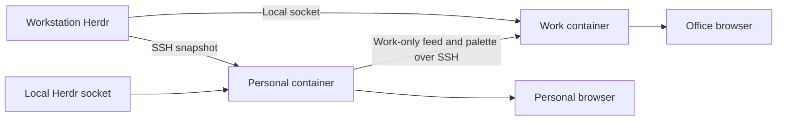

# Herdr Observatory

A passive display of Herdr agent activity across your machines. See working agents, tasks needing input, project titles, sampled state changes and resource telemetry in a full-screen dashboard that follows your Omarchy palette.

No agent controls, terminal transcripts or cloud service. Optional Work feeds and a persistent office-display service are explicitly deployed. Python 3.11+ standard library on collector hosts, a browser, Herdr 0.9.x with `api snapshot`, and OpenSSH for remote collection. No npm dependencies or build step.

## Architecture and daily operation

Both Personal and Work installations run the same dedicated, versioned Observatory image under Docker Compose. The Personal instance collects the fleet and sends a Work-only projection plus the active palette to the office instance over Tailscale SSH. The office instance also collects its own local agents independently. Neither depends on a development checkout or an interactive SSH session.



The browser on each host opens **http://localhost:8789**. On a native Linux installation, the recommended Compose directory is `~/.local/share/herdr-observatory/deploy`; for the named-volume Work installation below it is `~/.local/state/herdr-observatory/deployment`. Run these commands inside the installed directory:

```sh
docker compose ps                  # container and health status
docker compose logs --tail=50      # recent application logs
docker compose restart            # restart the installed release
docker compose stop               # stop now and keep stopped across reboots
docker compose start              # resume it and restore normal autostart
lazydocker                        # interactive Docker management, if installed
```

Both services use `unless-stopped`, health checks, bounded logs and read-only root filesystems. Enable the Linux Docker service at boot; the Windows workstation also needs its existing WSL headless startup. The containers do not open the browser automatically or override screen-lock policy. Installation, update and rollback instructions are below.

## Controlling autostart

The application runs in Docker on both machines. There is no separate Observatory systemd service, cron job or development server. On iapetus, the enabled system Docker service starts the container at boot. On the workstation, the existing Windows headless startup starts WSL, then its native Docker engine starts the container. Compose does not start Windows or WSL.

Docker's `unless-stopped` policy controls the application. To stop Observatory and leave it stopped across reboots, use `docker compose stop` in its deployment directory. To resume it, use `docker compose start`. This affects Observatory only; do not disable the shared Docker engine to stop this application.

For the installed container, these equivalent commands work from any directory:

```sh
docker stop herdr-observatory       # stop and keep stopped across reboots
docker start herdr-observatory      # resume, including subsequent boot startup
docker logs --tail=50 herdr-observatory
```

Run workstation commands through `ssh omaterm@ws-255`, for example `ssh omaterm@ws-255 docker stop herdr-observatory`.

To keep the application running now but disable automatic restarts, change `restart: unless-stopped` to `restart: "no"` in the installed `compose.yaml`, then run `docker compose up -d --wait`. Restore `unless-stopped` and apply again to re-enable automatic restarts. Keep that local policy when replacing deployment files during upgrades. A one-off `docker update --restart=no` is not a durable Compose setting: recreation restores the policy from the Compose file.

The browser is separate and does **not** autostart. Open `http://localhost:8789` manually. `deploy/Start-OfficeDisplay.ps1` is a manual Windows Edge kiosk launcher; this project has not installed a Windows login/startup task for it. Closing the browser does not stop collection. Existing lock and display-sleep policies are unchanged.

## Development run

```sh
cp config.example.json config.local.json
python -m observatory --config config.local.json --profile personal
```

Open **http://127.0.0.1:8789**. Use F or F11 for fullscreen. The card display fills one 16:9 browser viewport at 720p or 1080p, with a compact activity header and fleet strip above eight prominent thread cards. A small recent-activity area sits below them. Pane pages rotate every 15 seconds; Page Up/Down selects a page and holds it, R resumes rotation. C cycles All/Work/Personal on the Personal display. Auto-paging is enabled by default when more than eight permitted threads exist. The display has no pause or effect-timer controls; the OS reduced-motion preference suppresses animation. Ctrl+C stops a foreground server.

For a work display:

```sh
python -m observatory --config config.local.json --profile work
```

Work is the default. Add approved absolute paths to each host's `work_roots` before expecting agents there. Personal displays include both categories and provide a project filter. Switching the server profile requires a restart; browser query parameters cannot unlock Personal data.

## Configure machines

Compose uses its private `config/config.json`; the development runner uses `config.local.json`, which is ignored by Git. Keep real usernames, addresses and project roots there, not in examples or issues. Paths are evaluated on the source machine. The narrowest practical allowlist is best; `personal_roots` override work roots, and unclassified paths are always Personal.

```json
{
  "interval": 5,
  "theme_host": "desktop",
  "hosts": [
    {
      "id": "desktop",
      "label": "Desktop",
      "transport": "local",
      "work_roots": ["/home/user/work"],
      "personal_roots": ["/home/user/work/private"]
    },
    {
      "id": "workstation",
      "label": "Workstation",
      "transport": "ssh",
      "target": "workstation-ssh-alias",
      "herdr": "~/.local/bin/herdr",
      "work_roots": ["/home/user/work"]
    }
  ]
}
```

Use your SSH config for users, Tailscale routing, ProxyCommand and keys. Verify `ssh workstation-ssh-alias python3 --version` first. The collector uses batch mode and will not prompt for passwords or approve new host keys. Each sample sends the read-only Python probe over stdin and installs nothing remotely. New machines need working SSH, Python 3.11+ and Herdr before adding them. There is no network discovery.

`herdr` defaults to PATH, then `~/.local/bin/herdr`. Optional `session` chooses a named Herdr session; configure separate host IDs for multiple sessions. Each host has an independent worker. Snapshot polling is compatible with tested Herdr 0.9.0 and 0.9.1, avoiding terminal attach or takeover.

`theme_host` selects the machine supplying the palette. The collector reads `~/.local/state/omarchy/current/theme/colors.toml` and `theme.name`, falling back to the older `~/.config/omarchy/current` location. Valid colour changes appear on the next refresh. Missing colours use Tokyo Night defaults. No Omarchy hooks or config edits are needed. Fonts use installed JetBrains Mono / Cascadia Code with a monospace fallback; no external fonts are downloaded.

## Work display and Tailscale

Run an independent Work service on the workstation. The Personal laptop service can publish a Work-only projection over your existing SSH connection on Tailscale; reverse SSH to the laptop is unnecessary. Personal agents and history are removed before data crosses the connection. HTTP stays on loopback, with no public deployment or firewall changes.

Add this optional block to the laptop's private config. Use absolute paths on the receiving machine; these are examples, not deployment defaults:

```json
"publish": {
  "host_id": "desktop",
  "target": "workstation-ssh-alias",
  "container": "herdr-observatory",
  "path": "/feeds/desktop.json"
}
```

The source `host_id` must exist in the laptop config. Work roots there control what leaves the laptop. Personal exclusions win. The receiver runs the installed image in `container`. The publisher invokes its `python3 -m observatory.feed` module through `docker exec -i` over authenticated SSH and atomically writes a 0600 allowlisted file. Feed size is limited to 1 MiB. No HTTP upload endpoint is opened.

On the workstation, configure its local Herdr source plus the laptop feed:

```json
{
  "interval": 5,
  "theme_host": "desktop",
  "hosts": [
    {"id": "workstation", "transport": "local", "work_roots": ["/home/user/work"], "personal_roots": ["/home/user/personal"]},
    {"id": "desktop", "transport": "file", "path": "/feeds/desktop.json"}
  ]
}
```

Start the workstation with `--profile work`. A feed older than 30 seconds stops contributing agents or metrics. Local workstation collection continues independently. The last validated palette remains available from the feed file across display-service restarts. The laptop footer reports whether office synchronisation is working. Theme files on either machine are never modified.

For another browser on the tailnet, use an SSH loopback tunnel:

```sh
ssh -N -L 8789:127.0.0.1:8789 workstation-ssh-alias
```

Open `http://localhost:8789` on a device where port 8789 is free. Host validation requires the forwarded and service ports to match. The laptop's own Personal dashboard already provides its full fleet view without this tunnel. Do not bind the Personal service to a LAN or tailnet address.

### Windows office monitor

The service URL is **http://localhost:8789** on Windows when WSL localhost forwarding reaches the host-networked service. Copy `deploy/Start-OfficeDisplay.ps1` to Windows and run it in your logged-in desktop session. It checks that the endpoint is Work-only before opening Edge in full-screen kiosk mode. Alt+F4 exits the window.

The PowerShell launcher opens the display; the independently running container supplies the data. This avoids starting a second interactive Herdr client. Windows lock/display sleep policies remain unchanged. The container SSH shell cannot launch or verify a Windows desktop window unless Windows interoperability or a GUI connection is separately available.

## Technical display and what the numbers mean

The display takes visual inspiration from [Omarchy](https://omarchy.org): crisp mono typography, pixel accents, thin borders and the current OS palette. Eight thread cards occupy most of the screen, with automatic and manual paging for additional threads. Each shows project, task title, normal Herdr state, native pane identifier, harness and host. Supported hook data adds phase, tool, model and context/usage details. Missing data remains explicitly unavailable.

The header's “Observed activity” indicator responds to fresh state and hook changes, then settles when quiet. It is an activity cue, not measured token throughput or audio playback. Each affected card receives a brief impulse; working state indicators remain local to their card. Repeated unchanged samples do not restart the impulse. Paused, hidden, reduced-motion and unavailable views suppress animation.

The fleet strip labels processor, memory, graphics, storage, network traffic and sample age in plain language. The active OS theme colours backgrounds, card surfaces, borders, typography and status accents. Its name is visible in the header. Existing theme transport is unchanged: the host OS supplies the palette, and the Personal instance forwards it with the permitted Work feed. The browser does not modify the OS theme or need another service.

A separate recent-activity area shows four single-line observations: time, project, Herdr state, native pane identifier and pertinent update. Occasional text effects run only on an eligible incoming line here, never on thread cards. Effects finish naturally, then apply a fixed internal 120-second cooldown. Events received during playback or cooldown display immediately, without a backlog of animations. Quiet periods do not replay previous output. Source loss or the line leaving the visible recent history cancels obsolete playback. No decorative project-name artwork or travelling horizontal bands remain.

The bundled JetBrainsMono Nerd Font supplies the same typography on Linux and Windows without external requests. Readable words remain if it fails to load. Font source, checksum and licences live in `web/fonts/`.

Records are timestamped when the browser observes a transition, not when the underlying action happened. Collection is sampled and can miss brief intermediate states; this is not a complete Herdr event stream. Raw terminal content is never exported. Connection loss clears live panes without claiming they finished. The accessible text equivalent contains the current panes and the last 60 observations.

| Card field | Meaning | When absent |
| --- | --- | --- |
| State | Herdr's authoritative lifecycle state | Unknown |
| Activity / Tool | Latest supported hook phase and tool name | Unavailable |
| Model | Explicit, sanitised hook-reported model name | Unavailable, never inferred |
| Context | Approximate hook-reported tokens and window | Unavailable |
| Last response | Input/output tokens for the reported response | Unavailable |
| Cache read / write | Reported response cache tokens | Unavailable |
| Sample age | Age of the fleet source sample | Unavailable and agents excluded when stale |

Custom Herdr token/label maps, native session identifiers and terminal contents are not exported. Model, context and usage fields require supported hook reports. Herdr snapshots alone do not provide these metrics. A recognised harness running Qwen appears as an agent; a model name appears only when explicitly reported. Cost and token throughput are not inferred. Other machines can be added once SSH and Herdr are configured; there is no automatic fleet discovery.


- **Working / needs input / done:** Herdr's reported state, not inferred from CPU load. Done is the current state of that thread, not a count of tasks completed today.
- **Task titles:** the title Herdr reports. They can contain sensitive text; approve Work roots accordingly. This is not a tool-call or model-reasoning stream.
- **Observed changes:** discovered agents and changes between snapshots. Rapid transitions between samples can be missed. The backend retains bounded sampled history in memory and clears it at restart. The browser shows four recent observations and retains up to 60 in its accessible text history; old observations remain historical during an outage.
- **CPU and network:** deltas between successful samples. The first sample or a counter reset shows unavailable. Network totals exclude loopback, but may include virtual interfaces.
- **RAM / disk:** kernel memory and the configured source filesystem (`disk_path`, normally the mounted Herdr directory in Compose), or the collector user's home by default. Containers can report kernel-wide memory, while disk scope follows their filesystem. These are not native Windows host totals or cgroup quotas.
- **GPU:** optional `nvidia-smi`; mean utilisation and summed VRAM across visible GPUs. Unavailable where drivers/devices are not exposed, including many containers. The service never invokes Docker to acquire broader access.
- **Unavailable:** failed SSH, missing Herdr, incompatible data or stale sampling. Disconnected agents are excluded from current counts. The browser stops live activity on fetch failure and also expires old host samples.

## Access and disclosure

The server binds only to `127.0.0.1`, validates Host and Origin, sends no CORS headers and exposes only static assets plus read-only `GET /api/state`. It is a trusted local-user application, not a multi-user authenticated service. Any local process can read its selected profile. Use SSH loopback forwarding for remote viewing; keep the same port on both ends.

Work filtering happens before data enters the browser or history. Full path fields, native agent session identifiers, raw snapshots and terminal buffers are not returned. Machine labels and aggregate telemetry remain visible in either profile. Local configuration is trusted operator input, including SSH aliases. Do not publish your local config or live API output.

## Build a release

From a clean, reviewed checkout:

```sh
revision=$(git rev-parse HEAD)
docker build --build-arg REVISION="$revision" -t "herdr-observatory:$revision" .
```

The base image is digest-pinned. OpenSSH is installed at build time; preserve the resulting image for identical deployment and rollback. Never use a moving `latest` tag for releases. Transfer the same image to another engine with `docker save` and `docker load`, or use your authenticated registry. Only explicitly allowlisted application files enter the build context; private config is excluded.

## Harness telemetry (Codex and Pi)

The optional adapters share telemetry with **native Herdr and Observatory**. They run inside the harness environment on each machine. Codex uses one small shell adapter registered for several event types; Pi uses one extension. Both call `docker exec` to run the reporter already bundled in the Observatory image. Herdr stores expiring metadata; the existing local/SSH probe and Work feed carry its allowlisted fields. There is no additional daemon, listener, database, transcript tailer, Docker socket mount or background log collector.

| Data | Codex hooks | Pi extension |
| --- | --- | --- |
| Tool activity | Latest started/finished supported tool | Latest started/finished tool; reported error flag |
| Model | Hook-reported model | Active model identifier |
| Phase | Turn, tool, compact, idle, interruption | Turn, tool, reported thinking/output phase, compact, idle |
| Compaction | Start/completion | Start/completion/failure |
| Input/output/cache | Unavailable | **Last assistant response** reported input, output, cache read/write tokens |
| Context | Unavailable | **Estimated** current tokens against model context window |

A “finished” tool is not a claim that its command succeeded. Raw commands, arguments, tool output, prompts, transcript paths and reasoning text are never published. MCP and unknown tool identifiers become generic `mcp-tool`/`custom-tool` labels. Model identifiers are bounded identifiers, not content. Pi phase markers describe exposed events, not hidden reasoning. Local models work through Pi's normal event API; telemetry depends on the harness, not the model brand.

The native Herdr agent label gains a concise phase/tool/context hint. Its authoritative state, waits, notifications and session restoration stay under Herdr's own integration. Namespaced `obs_*` tokens are also available to custom Herdr sidebar rows. Observatory shows the latest hint in the thread card and concise sampled tool/compaction changes in recent activity, with available model/usage details. The source timestamp expires after **120 seconds without another report**; this means “no recent telemetry”, not “agent disconnected”. Very short tools can be missed between polls, and concurrent tools show the latest observed event, not a complete active-tool inventory. Full lossless tracing is outside this integration.

### Install or update on a machine

Prerequisites: a running Observatory container named `herdr-observatory`, Docker CLI access from the harness environment, Python 3.11+, `timeout`, and exactly one local host in its config using `socket_path`. Herdr must be running with its socket directory mounted into that container. Native Herdr Codex/Pi integrations must already be installed; where missing, use `herdr integration install codex` and `herdr integration install pi`. Codex needs `features.hooks = true` in its own config (the native integration normally enables it). Tested harness versions: Codex 0.154/0.155, Pi 0.85/0.86, Herdr protocol 22.

Run these commands **as the harness user** on each machine; on a WSL/omaterm setup, run inside omaterm:

```bash
installer=$(mktemp /tmp/observatory-install.XXXXXX.py)
docker cp herdr-observatory:/app/hooks/install.py "$installer"
python3 "$installer" --container herdr-observatory
rm -f "$installer"
```

The installer is idempotent and uses atomic file replacement. It refuses conflicting adapter files, symlinks and chezmoi-managed targets rather than overwriting them. It preserves unrelated/native hooks and extensions. A new fleet member needs its normal Observatory/Herdr setup plus this adapter installation; no Observatory checkout or extra service is needed. Re-run installation after updating an image to refresh adapter payloads.

Only these host additions remain:

- `~/.local/share/herdr-observatory/hooks/codex.sh` — silent, time-bounded forwarder.
- `~/.codex/hooks.json` — owned entries merged beside native hooks.
- `~/.pi/agent/extensions/observatory.ts` — event adapter with a bounded serial queue; no per-token subprocesses.
- `~/.local/share/herdr-observatory/hooks/hooks.before-install.json` — one private pre-install hook backup, if an existing config changed.

Start a **new Codex session** after installation. In Pi, use `/reload` or start a new session. Existing agents are not interrupted by installation. Adapters are silent outside Herdr or when Docker/Herdr is unavailable. Each reporter is limited to 1.5 seconds; the adapter caps Docker execution at 2 seconds. Pi queues at most 16 pending events and drops oldest entries under sustained overload. The only runtime scratch is one lock file in the container's existing `/tmp` tmpfs, removed when the container is recreated.

### Remove or roll back

Copy the installer as above and run `python3 "$installer" --uninstall` before deleting it. This removes only the owned Codex commands and the two adapter files; it does not uninstall Herdr's native integrations. The single private backup is retained for manual comparison and can be deleted once no longer needed. Restart/reload harnesses, then select the retained image using the deployment rollback procedure below. Already published telemetry expires within 120 seconds. Do not restore an old hooks.json over newer unrelated settings.

Work classification applies to this data before browser/history/feed publication. Personal or unknown projects remain excluded from the office display. No telemetry or local hook configuration belongs in the public repository.

## Install outside the checkout

Copy `deploy/compose.yaml` and the appropriate `deploy/compose.*.yaml` override into a persistent deployment directory, for example `~/.local/share/herdr-observatory/deploy` on the Personal host, or `~/.local/state/herdr-observatory/deployment` inside the Work host’s existing home volume. Store `.env` and a private `config/` directory there, mode 0700 with config files 0600. Keep the previous `.env` before an update.

Personal `.env` (substitute actual paths):

```dotenv
COMPOSE_FILE=compose.yaml:compose.personal.yaml
OBSERVATORY_IMAGE=herdr-observatory:REVIEWED_REVISION
OBSERVATORY_PROFILE=personal
OBSERVATORY_UID=1000
OBSERVATORY_GID=1000
OBSERVATORY_CONFIG_DIR=/home/user/.local/share/herdr-observatory/deploy/config
HERDR_DIRECTORY=/home/user/.config/herdr
OMARCHY_CURRENT=/home/user/.local/state/omarchy/current
```

The local host entry in `config/config.json` uses `socket_path: /herdr/herdr.sock`, `theme_path: /theme`, and `disk_path: /herdr`. Keep Work/Personal roots in the original host namespace, not container paths. For a named session, configure its actual socket filename. Socket collection bypasses the CLI, so do not combine `session` with `socket_path`.

For SSH collection/publication, place a dedicated `ssh_config` and verified `known_hosts` in `config/`. Set `UserKnownHostsFile /config/known_hosts`, `StrictHostKeyChecking yes` and `BatchMode yes`. Use a reachable Tailscale host address. Existing Tailscale SSH can authenticate without a private key; if ordinary SSH requires credentials, provision only a dedicated restricted credential. Do not mount the entire `.ssh` directory or disable host verification. Tailscale check-mode reauthentication remains an operator action.

Work `.env` for an existing named Herdr home volume:

```dotenv
COMPOSE_FILE=compose.yaml:compose.work.yaml
OBSERVATORY_IMAGE=herdr-observatory:REVIEWED_REVISION
OBSERVATORY_PROFILE=work
OBSERVATORY_UID=1000
OBSERVATORY_GID=1001
HOST_HOME_VOLUME=your-existing-home-volume
HERDR_SUBPATH=.config/herdr
OBSERVATORY_CONFIG_SUBPATH=.local/state/herdr-observatory/deployment/config
OBSERVATORY_FEED_SUBPATH=.local/state/herdr-observatory/feeds
```

Create both subdirectories in that existing volume before starting. The Work `config.json` uses `socket_path: /herdr/herdr.sock`, `disk_path: /herdr`, and laptop feed `path: /feeds/laptop.json`. The laptop publisher uses `container: herdr-observatory` and `path: /feeds/laptop.json` instead of `directory`. It sends an allowlisted Work payload through SSH to `docker exec -i herdr-observatory python3 -m observatory.feed /feeds/laptop.json`. Its SSH account needs access to that Docker engine; the dashboard itself has no Docker socket mount.

## Operate, update and roll back

Run from the installed deployment directory:

```sh
docker compose config --quiet
docker compose up -d --wait
docker compose ps
docker compose logs --tail=50
lazydocker
```

Ensure the Docker engine starts at boot (`systemctl is-enabled docker.service` on native Linux). A socket-activated engine may not start until a client connects: explicitly enable the service for unattended dashboards. On Windows, retain the existing WSL headless startup mechanism; Compose cannot start WSL itself. No reboot is needed for deployment.

For an update, load the reviewed image, save `.env` as `.env.previous`, change `OBSERVATORY_IMAGE`, then run `docker compose up -d --wait`. Verify `/api/state` profile, sources and palette. To roll back, restore `.env.previous` and rerun that command. Keep previous images until acceptance; do not prune unrelated images. `docker compose restart` restarts the installed version; it does not update the image. `docker compose stop` intentionally keeps it stopped across engine restarts until started again.

Stage on an alternate loopback port with `OBSERVATORY_PORT=8790 OBSERVATORY_CONTAINER=herdr-observatory-stage docker compose -p herdr-observatory-stage up -d --wait`. Use a staging config without publication when testing Personal mode. Remove only that staging project after verification. Then stop the old dashboard and start the installed project on 8789. Remove the transient Personal systemd unit only after the replacement is healthy. Do not recreate the Herdr/Omaterm container or its Tailscale identity.

Health checks test the HTTP service, not whether every source is online: offline hosts are an expected operating state. Restart policies restart exited processes, not merely unhealthy containers. Both sources poll independently and recover when Herdr or SSH returns. Logs rotate at 5 MiB, three files. Feed files survive application replacement; observation history remains in memory.

## Container integration boundaries

HTTP stays on 127.0.0.1:8789 via host networking. Containers run as the socket owner's UID, with read-only root, no capabilities and no Docker socket. Only configuration, Herdr's directory, the selected theme directory and the feed subdirectory are mounted. Mount the socket's containing directory so replacing the socket does not strand an old inode.

A read-only mount does not make a Unix socket read-only: code with socket access has Herdr's socket authority. Collectors send only `session.snapshot` and HTTP exposes no mutation endpoint. Explicitly installed harness adapters invoke the image reporter, which also reads `pane.get` and writes only owned, expiring `pane.report_metadata` presentation fields. It never reports lifecycle/session authority or sends agent input. The socket directory can contain Herdr logs/config; it is narrower than a home mount but not a separate read-only API permission. SSH credentials are similarly trusted integration authority.

CPU/RAM come from the Linux kernel, network from the shared host namespace and disk from the configured socket filesystem. GPU remains unavailable unless separately integrated. These are not native Windows totals. Open http://localhost:8789 on the display; the existing Windows kiosk launcher remains applicable.

## Verify

```sh
python -m unittest discover -s tests -v
node --check web/app.js
node --test tests/test_ui.cjs tests/test_wasm.mjs
openspec validate --all --strict
```

The application needs no OpenSpec installation to run. OpenSpec is used for project delivery. GitHub Actions runs Python tests, JavaScript syntax checks, UI regression tests and the complete WASM effect catalogue tests. Live compatibility testing is separate from automated fixture tests.

Protocol reference: [Herdr socket API](https://herdr.dev/docs/socket-api/).

### Browser text effects

All 37 bundled effects run locally through WebAssembly, using the same distribution served by Omarchy's website. A shuffled rotation visits every effect once before reshuffling and prevents consecutive repeats across rotations. Effects cover only a single incoming status-event line, sized to its text and anchored in place, and finish naturally. Some effects run substantially longer than others. No animation frames are downloaded from the server. Only the current frame's typed cell buffers are retained.

The browser composes live and animated scenes from the same filtered `/api/state` fields and its bounded timestamped observation records; the server also provides a bounded plain terminal layout. Fresh samples continue to update accessible current state without replacing an animation. Source loss or scrolling the animated line out of view cancels obsolete playback. Reduced motion shows the live card display; hidden tabs freeze playback. After completion a fixed internal cooldown of 120 seconds applies to later incoming status-line effects. Page Up/Down selects thread pages. Native effect gradients use the active theme; fixed upstream accents are mapped into the theme palette while preserving brightness. Library names are not shown in the interface.

`web/vendor/manifest.json` records exact download URLs, retrieval date and SHA-256 checksums. The wrapper is labelled 0.3.2 by the site; its all-effects WASM URL is unversioned, so the checksum is the actual pin. Assets and licence notices are vendored in the image: there is no runtime CDN dependency or Rust build. A future update must replace the matched wrapper/binary pair, update the manifest, run all catalogue and playback tests, rebuild the image and redeploy both profiles. The binary's original source build is not asserted reproducible here.

The server permits only explicit asset paths, serves WASM as `application/wasm`, and uses `script-src 'self' 'wasm-unsafe-eval'` without JavaScript eval or external scripts. The former `/api/text-frames` endpoint and native adapter have been removed. If WASM loading or execution fails, the live card display remains available and retries only on a new eligible event after the configured cooldown. Licences and attribution remain in `web/vendor/LICENSE` and `web/vendor/NOTICE`.

Run `python -m unittest discover -s tests -v`, `node --check web/app.js`, `node --test tests/test_ui.cjs tests/test_wasm.mjs`, and `openspec validate --all --strict`. The WASM tests verify artifact hashes and run every effect to completion using a synthetic single-line event.

### Further Herdr API coverage

The installed local Herdr 0.9.1 schema (protocol 22) exposes `interactive_ready`, `launch_pending`, `focused`, `revision` and `state_change_seq`; this display now uses those existing sanitised fields. Status transitions are discovered by polling, so rapid intermediate transitions can be missed. Revision and sequence values remain available to the collector; the compact cards prioritise task and hook information, and the footer states the sampling limitation. Timestamps denote observation time, not an asserted original event time. No token throughput or tool execution is inferred.

The next useful transport is [`events.subscribe`](https://herdr.dev/docs/socket-api/#event-subscriptions) for `pane.agent_status_changed`, detection, creation, exit and closure. A correct implementation subscribes before taking a bootstrap snapshot, buffers events during bootstrap, and resynchronises after reconnects; raw events must pass the Work disclosure boundary before publication. It is **not implemented in this release**. This would reduce missed intermediate transitions and polling latency.

Other documented opportunities are worktree lifecycle/provenance and typed metadata tokens. These need deliberate allowlisting: branch/worktree names and arbitrary agent-reported labels can expose personal information. `agent.explain` could provide state-detection diagnostics after schema and disclosure review. Raw `pane.read` output and control methods remain outside this passive display.

Thread cards use Herdr's Working, Blocked, Done, Idle and Unknown states. Hook-derived hints supplement those states without overriding Herdr. Refresh an already-open dashboard after an image update to load the latest browser code.

### Shared music and pixel background

The background adapts Omarchy’s actual pixel-field renderer, pinned to `omacom/omarchy-site@2af2bcdc41c1eba20a2f4d6a98b9521f5d014dc8`, including its noise, ordered dithering, spectrum columns and click stamps. Source attribution and adaptation details are retained in `web/vendor/OMARCHY-BACKGROUND-NOTICE`. It uses the synchronised OS palette, reacts to real music spectrum and produces local impulses when you click exposed background space. Cards and controls do not trigger these impulses. Text effects remain confined to occasional incoming event lines. Reduced motion makes the field stationary, and hidden tabs stop animation and music polling.

The current installation follows **cliamp on iapetus**, including track title and artist, on both displays. The application reads cliamp v2 `state.get` and `spectrum.get` over its Unix socket at up to 15 samples per second. It does not start a player, capture a microphone, play sound or install a daemon. Playback through cliamp's Spotify provider uses this same path. The standalone Spotify desktop/web player is not an audio source for this integration: track metadata alone is not a sound spectrum.

Enable the optional `deploy/compose.music.yaml` override on the source host, append it to `COMPOSE_FILE`, and set `CLIAMP_DIRECTORY` to the existing directory containing `cliamp.sock` (normally `~/.config/cliamp`). The directory is mounted read-only at `/music` so replacing the socket does not require a container restart. Socket access still confers IPC authority; the observer hardcodes only the two read methods. The observer UID must be allowed to open the socket. No entire home directory or Docker socket is mounted.

Add this private source configuration alongside the existing hosts:

```json
"music": {
  "socket_path": "/music/cliamp.sock",
  "publish": {
    "target": "user@office-host",
    "container": "herdr-observatory",
    "path": "/feeds/music.json"
  }
}
```

The receiver configuration uses `"music": {"path": "/feeds/music.json"}`. Its existing `/feeds` directory must exist and be writable. Omit `publish` for local-only music; omit `music` entirely to disable observation. This is an explicit disclosure choice separate from Work project classification. Only title, artist, playback state, bounded spectrum bands and capture time are shared, never file paths, artwork URLs, provider metadata or audio. Changing the Work filter does not change authorised music sharing.

One persistent SSH channel invokes the receiver module in the existing image and replaces a private latest-sample file. It reconnects after failure. Source timestamps are preserved and music expires after three seconds; stopped or missing music clears the widget and paused music has no audio-driven motion. This does not interrupt Herdr collection. The browser polls the loopback-only `/api/music` endpoint about ten times per second while visible. No new listener port or external browser connection is added.

Apply changed configuration using `docker compose up -d --force-recreate --wait`. For rollback after enabling music, restore both the previous image selection and private configuration, and omit the music override if the previous release predates this integration.

Fleet percentage gauges show processor, memory, graphics and storage usage. A dashed gauge means unavailable, distinct from a measured zero. Network arrows denote direction; their values remain measured rates. Thread identities label Agent (harness), Pane (Herdr's native workspace/pane identifier) and Host explicitly.
