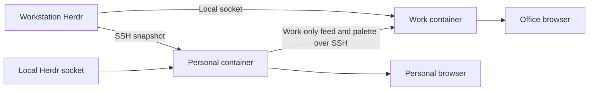

# Herdr Observatory

A passive display of Herdr agent activity across your machines. See working agents, tasks needing input, project titles, sampled state changes and resource telemetry in a full-screen dashboard that follows your Omarchy palette.

No agent controls, terminal transcripts or cloud service. Optional Work feeds and a persistent office-display service are explicitly deployed. Python 3.11+ standard library on collector hosts, a browser, Herdr 0.9.x with `api snapshot`, and OpenSSH for remote collection. No npm dependencies or build step.

## Architecture and daily operation

Both Personal and Work installations run the same dedicated, versioned Observatory image under Docker Compose. The Personal instance collects the fleet and sends a Work-only projection plus the active palette to the office instance over Tailscale SSH. The office instance also collects its own local agents independently. Neither depends on a development checkout or an interactive SSH session.



The browser on each host opens **http://localhost:8789**. On a native Linux installation, the recommended Compose directory is `~/.local/share/herdr-observatory/deploy`; for the named-volume Work installation below it is `~/.local/state/herdr-observatory/deployment`. Run these commands inside the installed directory:

```sh
docker compose ps                  # container and health status
docker compose logs --tail=50      # recent application logs
docker compose restart            # restart the installed release
docker compose stop               # intentionally stop it
lazydocker                        # interactive Docker management, if installed
```

Both services use `unless-stopped`, health checks, bounded logs and read-only root filesystems. Enable the Linux Docker service at boot; the Windows workstation also needs its existing WSL headless startup. The containers do not open the browser automatically or override screen-lock policy. Installation, update and rollback instructions are below.

## Development run

```sh
cp config.example.json config.local.json
python -m observatory --config config.local.json --profile personal
```

Open **http://127.0.0.1:8789**. Use F or F11 for fullscreen. The rendered terminal fits one 16:9 screen. Pane pages rotate every 15 seconds; Left/Right selects a page and holds it, R resumes rotation. C cycles All/Work/Personal on the Personal display. Space pauses visual effects. Collection continues while effects are paused. Ctrl+C stops a foreground server.

For a work display:

```sh
python -m observatory --config config.local.json --profile work
```

Work is the default. Add approved absolute paths to each host's `work_roots` before expecting agents there. Personal displays include both categories and provide a project filter. Switching the server profile requires a restart; browser query parameters cannot unlock Personal data.

## Configure machines

Compose uses its private `config/config.json`; the development runner uses `config.local.json`, which is ignored by Git. Keep real usernames, addresses and project roots there, not in examples or issues. Paths are evaluated on the source machine. The narrowest practical allowlist is best; `personal_roots` override work roots, and unclassified paths are always Personal.

```json
{
  "interval": 5,
  "theme_host": "desktop",
  "hosts": [
    {
      "id": "desktop",
      "label": "Desktop",
      "transport": "local",
      "work_roots": ["/home/user/work"],
      "personal_roots": ["/home/user/work/private"]
    },
    {
      "id": "workstation",
      "label": "Workstation",
      "transport": "ssh",
      "target": "workstation-ssh-alias",
      "herdr": "~/.local/bin/herdr",
      "work_roots": ["/home/user/work"]
    }
  ]
}
```

Use your SSH config for users, Tailscale routing, ProxyCommand and keys. Verify `ssh workstation-ssh-alias python3 --version` first. The collector uses batch mode and will not prompt for passwords or approve new host keys. Each sample sends the read-only Python probe over stdin and installs nothing remotely. New machines need working SSH, Python 3.11+ and Herdr before adding them. There is no network discovery.

`herdr` defaults to PATH, then `~/.local/bin/herdr`. Optional `session` chooses a named Herdr session; configure separate host IDs for multiple sessions. Each host has an independent worker. Snapshot polling is compatible with tested Herdr 0.9.0 and 0.9.1, avoiding terminal attach or takeover.

`theme_host` selects the machine supplying the palette. The collector reads `~/.local/state/omarchy/current/theme/colors.toml` and `theme.name`, falling back to the older `~/.config/omarchy/current` location. Valid colour changes appear on the next refresh. Missing colours use Tokyo Night defaults. No Omarchy hooks or config edits are needed. Fonts use installed JetBrains Mono / Cascadia Code with a monospace fallback; no external fonts are downloaded.

## Work display and Tailscale

Run an independent Work service on the workstation. The Personal laptop service can publish a Work-only projection over your existing SSH connection on Tailscale; reverse SSH to the laptop is unnecessary. Personal agents and history are removed before data crosses the connection. HTTP stays on loopback, with no public deployment or firewall changes.

Add this optional block to the laptop's private config. Use absolute paths on the receiving machine; these are examples, not deployment defaults:

```json
"publish": {
  "host_id": "desktop",
  "target": "workstation-ssh-alias",
  "container": "herdr-observatory",
  "path": "/feeds/desktop.json"
}
```

The source `host_id` must exist in the laptop config. Work roots there control what leaves the laptop. Personal exclusions win. The receiver runs the installed image in `container`. The publisher invokes its `python3 -m observatory.feed` module through `docker exec -i` over authenticated SSH and atomically writes a 0600 allowlisted file. Feed size is limited to 1 MiB. No HTTP upload endpoint is opened.

On the workstation, configure its local Herdr source plus the laptop feed:

```json
{
  "interval": 5,
  "theme_host": "desktop",
  "hosts": [
    {"id": "workstation", "transport": "local", "work_roots": ["/home/user/work"], "personal_roots": ["/home/user/personal"]},
    {"id": "desktop", "transport": "file", "path": "/feeds/desktop.json"}
  ]
}
```

Start the workstation with `--profile work`. A feed older than 30 seconds stops contributing agents or metrics. Local workstation collection continues independently. The last validated palette remains available from the feed file across display-service restarts. The laptop footer reports whether office synchronisation is working. Theme files on either machine are never modified.

For another browser on the tailnet, use an SSH loopback tunnel:

```sh
ssh -N -L 8789:127.0.0.1:8789 workstation-ssh-alias
```

Open `http://localhost:8789` on a device where port 8789 is free. Host validation requires the forwarded and service ports to match. The laptop's own Personal dashboard already provides its full fleet view without this tunnel. Do not bind the Personal service to a LAN or tailnet address.

### Windows office monitor

The service URL is **http://localhost:8789** on Windows when WSL localhost forwarding reaches the host-networked service. Copy `deploy/Start-OfficeDisplay.ps1` to Windows and run it in your logged-in desktop session. It checks that the endpoint is Work-only before opening Edge in full-screen kiosk mode. Alt+F4 exits the window.

The PowerShell launcher opens the display; the independently running container supplies the data. This avoids starting a second interactive Herdr client. Windows lock/display sleep policies remain unchanged. The container SSH shell cannot launch or verify a Windows desktop window unless Windows interoperability or a GUI connection is separately available.

## Technical display and what the numbers mean

The display is a character-cell TUI: current thread states stay fixed and clear above a separate CLI feed. The feed uses the actual [ttfx](https://github.com/omacom/ttfx) Rust library (`decrypt`, `vhstape`, `crumble`), pinned by commit and Cargo.lock. There are no decorative circles or background geometry. The library animates permitted sampled observations; it does not read shell output. Pause and reduced motion show the original text immediately.

Records are timestamped when the browser observes a transition, not when the underlying action happened. Collection is sampled and can miss brief intermediate states; this is not a complete Herdr event stream. Prompts are interface labels, not executed shell commands. Raw terminal content is never exported. Connection loss clears live panes without claiming they finished. The accessible text equivalent contains the current panes and the last 60 observations.

| Technical field | Meaning | When absent |
| --- | --- | --- |
| REV | Herdr pane revision | Em dash |
| SEQ | Herdr state-change sequence number, not completed tasks | Em dash |
| FOCUS / BACKGROUND | Whether Herdr reports the pane focused | Em dash |
| READY / NOT READY / LAUNCHING | Optional Herdr readiness and launch-pending flags | Em dash on versions that omit them |
| P number | Herdr socket protocol version | Em dash |
| Sample age / UNAVAILABLE | Age and availability of the sampled source | Unavailable and agents excluded when stale |

Custom Herdr token/label maps, session identifiers and terminal contents are not exported. The snapshot currently supplies no verified model name, token usage, cost, context utilisation or tool-call throughput to this dashboard. A Qwen-backed recognised harness can appear as an agent, but its model identity is not inferred. Other machines can be added once SSH and Herdr are configured; there is no automatic fleet discovery.


- **Working / needs input / done:** Herdr's reported state, not inferred from CPU load. Done is the current number of agents in that state, not tasks completed today.
- **Task titles:** the title Herdr reports. They can contain sensitive text; approve Work roots accordingly. This is not a tool-call or model-reasoning stream.
- **Observed changes:** discovered agents and changes between snapshots. Rapid transitions between samples can be missed. The last 100 observations and 60 working-count samples per host are retained in memory and cleared at restart. History remains visible as historical data during an outage; the working-count trace leaves gaps for unavailable Herdr samples.
- **CPU and network:** deltas between successful samples. The first sample or a counter reset shows unavailable. Network totals exclude loopback, but may include virtual interfaces.
- **RAM / disk:** kernel memory and the configured source filesystem (`disk_path`, normally the mounted Herdr directory in Compose), or the collector user's home by default. Containers can report kernel-wide memory, while disk scope follows their filesystem. These are not native Windows host totals or cgroup quotas.
- **GPU:** optional `nvidia-smi`; mean utilisation and summed VRAM across visible GPUs. Unavailable where drivers/devices are not exposed, including many containers. The service never invokes Docker to acquire broader access.
- **Unavailable:** failed SSH, missing Herdr, incompatible data or stale sampling. Disconnected agents are excluded from current counts. The browser stops live activity on fetch failure and also expires old host samples.

## Access and disclosure

The server binds only to `127.0.0.1`, validates Host and Origin, sends no CORS headers and exposes only static assets plus read-only `GET /api/state`. It is a trusted local-user application, not a multi-user authenticated service. Any local process can read its selected profile. Use SSH loopback forwarding for remote viewing; keep the same port on both ends.

Work filtering happens before data enters the browser or history. Full path fields, native agent session identifiers, raw snapshots and terminal buffers are not returned. Machine labels and aggregate telemetry remain visible in either profile. Local configuration is trusted operator input, including SSH aliases. Do not publish your local config or live API output.

## Build a release

From a clean, reviewed checkout:

```sh
revision=$(git rev-parse HEAD)
docker build --build-arg REVISION="$revision" -t "herdr-observatory:$revision" .
```

The base image is digest-pinned. OpenSSH is installed at build time; preserve the resulting image for identical deployment and rollback. Never use a moving `latest` tag for releases. Transfer the same image to another engine with `docker save` and `docker load`, or use your authenticated registry. Only explicitly allowlisted application files enter the build context; private config is excluded.

## Install outside the checkout

Copy `deploy/compose.yaml` and the appropriate `deploy/compose.*.yaml` override into a persistent deployment directory, for example `~/.local/share/herdr-observatory/deploy` on the Personal host, or `~/.local/state/herdr-observatory/deployment` inside the Work host’s existing home volume. Store `.env` and a private `config/` directory there, mode 0700 with config files 0600. Keep the previous `.env` before an update.

Personal `.env` (substitute actual paths):

```dotenv
COMPOSE_FILE=compose.yaml:compose.personal.yaml
OBSERVATORY_IMAGE=herdr-observatory:REVIEWED_REVISION
OBSERVATORY_PROFILE=personal
OBSERVATORY_UID=1000
OBSERVATORY_GID=1000
OBSERVATORY_CONFIG_DIR=/home/user/.local/share/herdr-observatory/deploy/config
HERDR_DIRECTORY=/home/user/.config/herdr
OMARCHY_CURRENT=/home/user/.local/state/omarchy/current
```

The local host entry in `config/config.json` uses `socket_path: /herdr/herdr.sock`, `theme_path: /theme`, and `disk_path: /herdr`. Keep Work/Personal roots in the original host namespace, not container paths. For a named session, configure its actual socket filename. Socket collection bypasses the CLI, so do not combine `session` with `socket_path`.

For SSH collection/publication, place a dedicated `ssh_config` and verified `known_hosts` in `config/`. Set `UserKnownHostsFile /config/known_hosts`, `StrictHostKeyChecking yes` and `BatchMode yes`. Use a reachable Tailscale host address. Existing Tailscale SSH can authenticate without a private key; if ordinary SSH requires credentials, provision only a dedicated restricted credential. Do not mount the entire `.ssh` directory or disable host verification. Tailscale check-mode reauthentication remains an operator action.

Work `.env` for an existing named Herdr home volume:

```dotenv
COMPOSE_FILE=compose.yaml:compose.work.yaml
OBSERVATORY_IMAGE=herdr-observatory:REVIEWED_REVISION
OBSERVATORY_PROFILE=work
OBSERVATORY_UID=1000
OBSERVATORY_GID=1001
HOST_HOME_VOLUME=your-existing-home-volume
HERDR_SUBPATH=.config/herdr
OBSERVATORY_CONFIG_SUBPATH=.local/state/herdr-observatory/deployment/config
OBSERVATORY_FEED_SUBPATH=.local/state/herdr-observatory/feeds
```

Create both subdirectories in that existing volume before starting. The Work `config.json` uses `socket_path: /herdr/herdr.sock`, `disk_path: /herdr`, and laptop feed `path: /feeds/laptop.json`. The laptop publisher uses `container: herdr-observatory` and `path: /feeds/laptop.json` instead of `directory`. It sends an allowlisted Work payload through SSH to `docker exec -i herdr-observatory python3 -m observatory.feed /feeds/laptop.json`. Its SSH account needs access to that Docker engine; the dashboard itself has no Docker socket mount.

## Operate, update and roll back

Run from the installed deployment directory:

```sh
docker compose config --quiet
docker compose up -d --wait
docker compose ps
docker compose logs --tail=50
lazydocker
```

Ensure the Docker engine starts at boot (`systemctl is-enabled docker.service` on native Linux). A socket-activated engine may not start until a client connects: explicitly enable the service for unattended dashboards. On Windows, retain the existing WSL headless startup mechanism; Compose cannot start WSL itself. No reboot is needed for deployment.

For an update, load the reviewed image, save `.env` as `.env.previous`, change `OBSERVATORY_IMAGE`, then run `docker compose up -d --wait`. Verify `/api/state` profile, sources and palette. To roll back, restore `.env.previous` and rerun that command. Keep previous images until acceptance; do not prune unrelated images. `docker compose restart` restarts the installed version; it does not update the image. `docker compose stop` intentionally keeps it stopped across engine restarts until started again.

Stage on an alternate loopback port with `OBSERVATORY_PORT=8790 OBSERVATORY_CONTAINER=herdr-observatory-stage docker compose -p herdr-observatory-stage up -d --wait`. Use a staging config without publication when testing Personal mode. Remove only that staging project after verification. Then stop the old dashboard and start the installed project on 8789. Remove the transient Personal systemd unit only after the replacement is healthy. Do not recreate the Herdr/Omaterm container or its Tailscale identity.

Health checks test the HTTP service, not whether every source is online: offline hosts are an expected operating state. Restart policies restart exited processes, not merely unhealthy containers. Both sources poll independently and recover when Herdr or SSH returns. Logs rotate at 5 MiB, three files. Feed files survive application replacement; observation history remains in memory.

## Container integration boundaries

HTTP stays on 127.0.0.1:8789 via host networking. Containers run as the socket owner's UID, with read-only root, no capabilities and no Docker socket. Only configuration, Herdr's directory, the selected theme directory and the feed subdirectory are mounted. Mount the socket's containing directory so replacing the socket does not strand an old inode.

A read-only mount does not make a Unix socket read-only: code with socket access has Herdr's socket authority. Observatory sends only `session.snapshot` and exposes no mutation endpoint. The socket directory can contain Herdr logs/config; it is narrower than a home mount but not a separate read-only API permission. SSH credentials are similarly trusted integration authority.

CPU/RAM come from the Linux kernel, network from the shared host namespace and disk from the configured socket filesystem. GPU remains unavailable unless separately integrated. These are not native Windows totals. Open http://localhost:8789 on the display; the existing Windows kiosk launcher remains applicable.

## Verify

```sh
python -m unittest discover -s tests -v
node --check web/app.js
node --test tests/test_ui.cjs
openspec validate --all --strict
```

The application needs no OpenSpec installation to run. OpenSpec is used for project delivery. GitHub Actions runs Python tests and JavaScript syntax checks. Live compatibility testing is separate from automated fixture tests.

Protocol reference: [Herdr socket API](https://herdr.dev/docs/socket-api/).

### Text renderer build

Docker builds `renderer/` in a pinned Rust build stage and copies its executable into the runtime image. Nothing is installed at runtime. If the local Docker build network cannot resolve dependency hosts, use `docker build --network host` for the build; runtime networking is unchanged. For a local development server, run `cargo build --release --locked --manifest-path renderer/Cargo.toml` and set `OBSERVATORY_TEXT_RENDERER="$PWD/renderer/target/release/observatory-text"`. Without the adapter, the feed falls back to plain text.

The read-only `/api/text-frames` endpoint derives text from the same server-filtered state as the TUI. It accepts no text or effect arguments. Frames are cached per capture, generation has a two-second deadline, and playback is bounded to 120 frames of 100×6 cells. Long observation sets rotate in batches. Licence and upstream TTE attribution are retained in `renderer/TTFX-LICENSE` and `renderer/NOTICE`.
